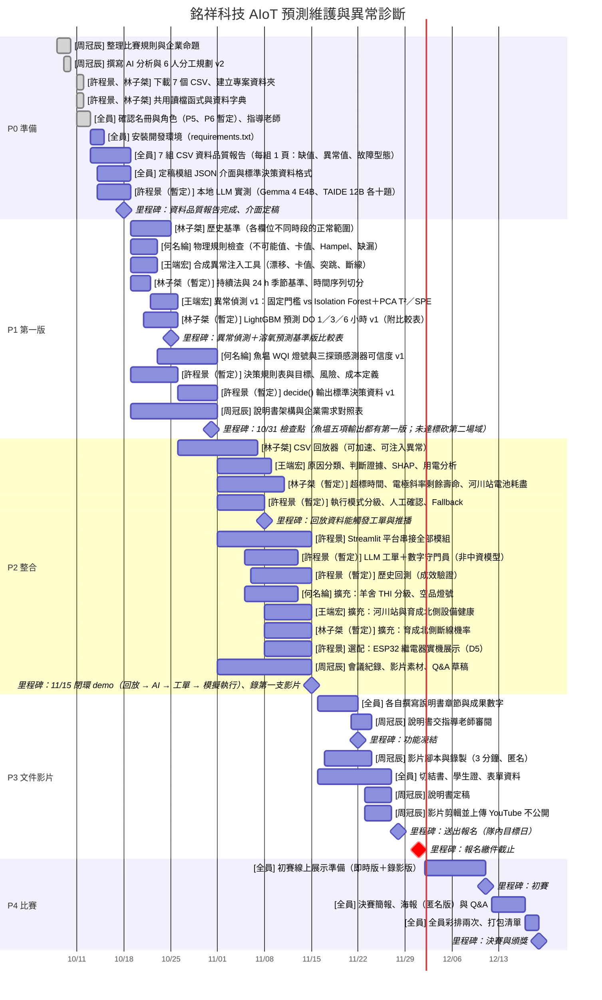

# 執行甘特圖（Mermaid 版）

> 由 `scripts/build_gantt.py` 從 `tasks.csv` 產生，資料日期 2026-11-08。
> 進度 5/36（14%），距 12/1 截止 23 天。
> 互動版請開 [gantt.html](gantt.html)。

```mermaid
gantt
    title 銘祥科技 AIoT 預測維護與異常診斷
    dateFormat YYYY-MM-DD
    axisFormat %m/%d
    todayMarker stroke-width:2px,stroke:#d13b3b
    section P0 準備
    [周冠辰] 整理比賽規則與企業命題 :done, S01, 2026-10-08, 2d
    [周冠辰] 撰寫 AI 分析與 6 人分工規劃 v2 :done, S02, 2026-10-09, 1d
    [許程景、林子桀] 下載 7 個 CSV、建立專案資料夾 :done, S03, 2026-10-11, 1d
    [許程景、林子桀] 共用讀檔函式與資料字典 :done, S04, 2026-10-11, 1d
    [全員] 確認名冊與角色（P5、P6 暫定）、指導老師 :done, S05, 2026-10-11, 2d
    [全員] 安裝開發環境（requirements.txt） :S08, 2026-10-13, 2d
    [全員] 7 組 CSV 資料品質報告（每組 1 頁：缺值、異常值、故障型態） :S09, 2026-10-13, 6d
    [全員] 定稿模組 JSON 介面與標準決策資料格式 :S10, 2026-10-14, 5d
    [許程景（暫定）] 本地 LLM 實測（Gemma 4 E4B、TAIDE 12B 各十題） :S11, 2026-10-14, 5d
    里程碑：資料品質報告完成、介面定稿 :milestone, M1, 2026-10-18, 0d
    section P1 第一版
    [林子桀] 歷史基準（各欄位不同時段的正常範圍） :A1, 2026-10-19, 6d
    [何名綸] 物理規則檢查（不可能值、卡值、Hampel、缺漏） :B1, 2026-10-19, 4d
    [王端宏] 合成異常注入工具（漂移、卡值、突跳、斷線） :C1, 2026-10-19, 4d
    [林子桀（暫定）] 持續法與 24 h 季節基準、時間序列切分 :D1, 2026-10-19, 3d
    [王端宏] 異常偵測 v1：固定門檻 vs Isolation Forest＋PCA T²／SPE :C2, 2026-10-22, 4d
    [林子桀（暫定）] LightGBM 預測 DO 1／3／6 小時 v1（附比較表） :D2, 2026-10-21, 5d
    里程碑：異常偵測＋溶氧預測基準版比較表 :milestone, M2, 2026-10-25, 0d
    [何名綸] 魚塭 WQI 燈號與三探頭感測器可信度 v1 :B2, 2026-10-23, 9d
    [許程景（暫定）] 決策規則表與目標、風險、成本定義 :E1, 2026-10-19, 7d
    [許程景（暫定）] decide() 輸出標準決策資料 v1 :E2, 2026-10-26, 6d
    [周冠辰] 說明書架構與企業需求對照表 :F1, 2026-10-19, 13d
    里程碑：10/31 檢查點（魚塭五項輸出都有第一版；未達標砍第二場域） :milestone, M3, 2026-10-31, 0d
    section P2 整合
    [林子桀] CSV 回放器（可加速、可注入異常） :A2, 2026-10-26, 12d
    [王端宏] 原因分類、判斷證據、SHAP、用電分析 :C3, 2026-11-01, 8d
    [林子桀（暫定）] 超標時間、電極斜率剩餘壽命、河川站電池耗盡 :D3, 2026-11-01, 10d
    [許程景（暫定）] 執行模式分級、人工確認、Fallback :E3, 2026-11-01, 7d
    里程碑：回放資料能觸發工單與推播 :milestone, M4, 2026-11-08, 0d
    [許程景] Streamlit 平台串接全部模組 :A3, 2026-11-01, 14d
    [許程景（暫定）] LLM 工單＋數字守門員（非中資模型） :E4, 2026-11-05, 8d
    [許程景（暫定）] 歷史回測（成效驗證） :E5, 2026-11-06, 9d
    [何名綸] 擴充：羊舍 THI 分級、空品燈號 :B3, 2026-11-05, 8d
    [王端宏] 擴充：河川站與育成北側設備健康 :C4, 2026-11-08, 7d
    [林子桀（暫定）] 擴充：育成北側斷線機率 :D4, 2026-11-08, 7d
    [許程景] 選配：ESP32 繼電器實機展示（D5） :A4, 2026-11-08, 7d
    [周冠辰] 會議紀錄、影片素材、Q&A 草稿 :F2, 2026-11-01, 14d
    里程碑：11/15 閉環 demo（回放 → AI → 工單 → 模擬執行）、錄第一支影片 :milestone, M5, 2026-11-15, 0d
    section P3 文件影片
    [全員] 各自撰寫說明書章節與成果數字 :G1, 2026-11-16, 6d
    [周冠辰] 說明書交指導老師審閱 :G2, 2026-11-21, 3d
    里程碑：功能凍結 :milestone, M6, 2026-11-22, 0d
    [周冠辰] 影片腳本與錄製（3 分鐘、匿名） :G3, 2026-11-17, 7d
    [全員] 切結書、學生證、表單資料 :G4, 2026-11-16, 11d
    [周冠辰] 說明書定稿 :G5, 2026-11-23, 4d
    [周冠辰] 影片剪輯並上傳 YouTube 不公開 :G6, 2026-11-23, 4d
    里程碑：送出報名（隊內目標日） :milestone, M7, 2026-11-28, 0d
    里程碑：報名繳件截止 :crit, milestone, M8, 2026-12-01, 0d
    section P4 比賽
    [全員] 初賽線上展示準備（即時版＋錄影版） :H1, 2026-12-02, 9d
    里程碑：初賽 :milestone, M9, 2026-12-11, 0d
    [全員] 決賽簡報、海報（匿名版）與 Q&A :H2, 2026-12-12, 5d
    [全員] 全員彩排兩次、打包清單 :H3, 2026-12-17, 2d
    里程碑：決賽與頒獎 :milestone, M10, 2026-12-19, 0d
```
