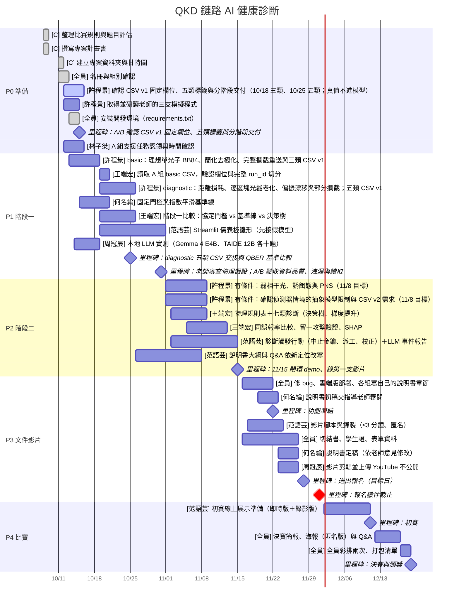

# 執行甘特圖（Mermaid 版）

> 由 `scripts/build_gantt.py` 從 `tasks.csv` 產生，資料日期 2026-11-26。
> 進度 5/30（17%），距 12/1 截止 5 天。
> 互動版請開 [gantt.html](gantt.html)。

```mermaid
gantt
    title QKD 鏈路 AI 健康診斷
    dateFormat YYYY-MM-DD
    axisFormat %m/%d
    todayMarker stroke-width:2px,stroke:#d13b3b
    section P0 準備
    [C] 整理比賽規則與題目評估 :done, T01, 2026-10-08, 1d
    [C] 撰寫專案計畫書 :done, T02, 2026-10-08, 1d
    [C] 建立專案資料夾與甘特圖 :done, T03, 2026-10-11, 1d
    [全員] 名冊與組別確認 :done, T04, 2026-10-11, 2d
    [許程景] 確認 CSV v1 固定欄位、五類標籤與分階段交付（10/18 三類、10/25 五類；真值不進模型） :active, T07, 2026-10-12, 4d
    [許程景] 取得並研讀老師的三支模擬程式 :T08, 2026-10-12, 3d
    [全員] 安裝開發環境（requirements.txt） :done, T09, 2026-10-13, 2d
    里程碑：A/B 確認 CSV v1 固定欄位、五類標籤與分階段交付 :milestone, M1, 2026-10-15, 0d
    [林子桀] A 組支援任務認領與時間確認 :T10, 2026-10-12, 4d
    section P1 階段一
    [許程景] basic：理想單光子 BB84、簡化去極化、完整攔截重送與三類 CSV v1 :A1, 2026-10-13, 6d
    [王端宏] 讀取 A 組 basic CSV，驗證欄位與完整 run_id 切分 :B1, 2026-10-19, 2d
    [許程景] diagnostic：距離損耗、逐區塊光纖老化、偏振漂移與部分攔截；五類 CSV v1 :A2, 2026-10-19, 7d
    [何名綸] 固定門檻與指數平滑基準線 :B2, 2026-10-15, 6d
    [王端宏] 階段一比較：協定門檻 vs 基準線 vs 決策樹 :B3, 2026-10-19, 7d
    [范語芸] Streamlit 儀表板雛形（先接假模型） :C1, 2026-10-19, 13d
    [周冠辰] 本地 LLM 實測（Gemma 4 E4B、TAIDE 12B 各十題） :C2, 2026-10-14, 5d
    里程碑：diagnostic 五類 CSV 交接與 QBER 基準比較 :milestone, M2, 2026-10-25, 0d
    里程碑：老師審查物理假設；A/B 驗收資料品質、洩漏與讀取 :milestone, M3, 2026-10-31, 0d
    section P2 階段二
    [許程景] 有條件：弱相干光、誘餌態與 PNS（11/8 目標） :A3, 2026-11-01, 8d
    [許程景] 有條件：確認偵測器情境的抽象模型限制與 CSV v2 需求（11/8 目標） :A4, 2026-11-01, 8d
    [王端宏] 物理規則表＋七類診斷（決策樹、梯度提升） :B4, 2026-11-02, 7d
    [王端宏] 同誤報率比較、留一攻擊驗證、SHAP :B5, 2026-11-05, 8d
    [范語芸] 診斷觸發行動（中止金鑰、派工、校正）＋LLM 事件報告 :C3, 2026-11-02, 13d
    [范語芸] 說明書大綱與 Q&A 依新定位改寫 :C4, 2026-10-26, 13d
    里程碑：11/15 閉環 demo、錄第一支影片 :milestone, M4, 2026-11-15, 0d
    section P3 文件影片
    [全員] 修 bug、雲端版部署、各組寫自己的說明書章節 :D1, 2026-11-16, 6d
    [何名綸] 說明書初稿交指導老師審閱 :D2, 2026-11-19, 4d
    里程碑：功能凍結 :milestone, M5, 2026-11-22, 0d
    [范語芸] 影片腳本與錄製（≤3 分鐘、匿名） :D3, 2026-11-17, 7d
    [全員] 切結書、學生證、表單資料 :D4, 2026-11-16, 11d
    [何名綸] 說明書定稿（依老師意見修改） :D5, 2026-11-23, 4d
    [周冠辰] 影片剪輯並上傳 YouTube 不公開 :D6, 2026-11-23, 4d
    里程碑：送出報名（目標日） :milestone, M6, 2026-11-28, 0d
    里程碑：報名繳件截止 :crit, milestone, M7, 2026-12-01, 0d
    section P4 比賽
    [范語芸] 初賽線上展示準備（即時版＋錄影版） :E1, 2026-12-02, 9d
    里程碑：初賽 :milestone, M8, 2026-12-11, 0d
    [全員] 決賽簡報、海報（匿名版）與 Q&A :E2, 2026-12-12, 5d
    [全員] 全員彩排兩次、打包清單 :E3, 2026-12-17, 2d
    里程碑：決賽與頒獎 :milestone, M9, 2026-12-19, 0d
```
